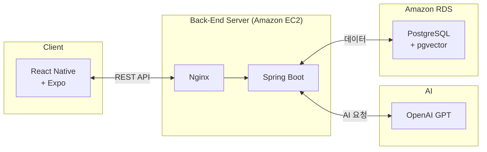

# 📆 Plannie — AI 챗봇 기반 일정 관리 앱

> 계획 세우는 게 어려울 땐? **Plannie**  
> AI와 대화하듯 일정을 추가하고, 학습 계획을 자동으로 생성해주는 React Native 앱입니다.

---

## 🗺️ 화면 흐름

```
StartPage
  └─ Login ─────────────────────────────── Calendar (메인)
       └─ SignUp1 → SignUp2 → SignUp3          │
                                      ┌────────┼────────┐
                                  ChatMain  Calendar  MyPageMain
                                                │         │
                                          ScheduleAdd   MyPageProfile → ProfileEdit
                                          MonthList     MyPageNotice
                                                        MyPageAlarm
                                                        MyPageEnquire
                                                        DeleteAccount
```

---

## 🏗️ 서비스 아키텍처


```mermaid
flowchart LR
    subgraph Client["Client"]
        RN["React Native\n+ Expo"]
    end

    subgraph Backend["Back-End Server (Amazon EC2)"]
        direction TB
        Nginx["Nginx"]
        Spring["Spring Boot"]
    end

    subgraph AI["AI"]
        OpenAI["OpenAI GPT"]
    end

    subgraph DB["Amazon RDS"]
        PostgreSQL["PostgreSQL\n+ pgvector"]
    end

    RN <-->|REST API| Nginx
    Nginx --> Spring
    Spring <-->|AI 요청| OpenAI
    Spring <-->|데이터| PostgreSQL
```

---

## 📚 Tech Stack

### Frontend


### Backend


### AI


### Database


### Infra


---

## ⚙️ 주요 기능

- **AI 채팅 기반 일정 관리** — 자연어 입력으로 일정 추가·삭제·월별 대량 삭제
- **학습 계획 자동 생성** — 시험명·기간·공부 시간을 입력하면 AI가 일정 자동 생성
- **캘린더 뷰** — 월별 일정 시각화 및 날짜별 일정 확인
- **회원 관리** — 회원가입(3단계)·로그인·프로필 조회 및 수정·회원 탈퇴

---

## 🚀 시작하기

```bash
# 의존성 설치
cd plannie
npm install

# 환경 변수 설정
# .env에 API_URL 입력

# 앱 실행
npx expo start
```

---

## 📁 프로젝트 구조

```
plannie/
├── App.js                   # 루트 네비게이터 (RootStack)
├── GlobalStyles.jsx         # 공통 색상·폰트 상수
├── nav/                     # 네비게이션 컴포넌트
│   ├── BottomNav.jsx        # 하단 탭 (캘린더·채팅·마이페이지)
│   ├── MyPageTopNav.jsx     # 마이페이지 상단 네비
│   └── BackButton.jsx       # 뒤로가기 버튼
├── screens/                 # 화면 컴포넌트 (17개)
│   ├── api/                 # API 호출 모듈
│   │   ├── user.js          # 인증·프로필
│   │   ├── signup.js        # 회원가입
│   │   └── planner.js       # 일정 CRUD
│   └── ...
├── Styles/                  # 화면별 스타일 파일
└── assets/                  # 이미지·폰트
```

---

## ✅ 향후 과제

- [ ] 소셜 로그인 (카카오, 구글)
- [ ] 아이디 / 비밀번호 찾기 기능
- [ ] 푸시 알림 연동
- [ ] 반복 일정 기능 (매일·매주·매월)
- [ ] 프로필 이미지 직접 업로드
- [ ] 일정 공유 및 그룹 플래너
- [ ] AI 응답 정확도 개선 및 모델 업그레이드
- [ ] 다크모드 지원
