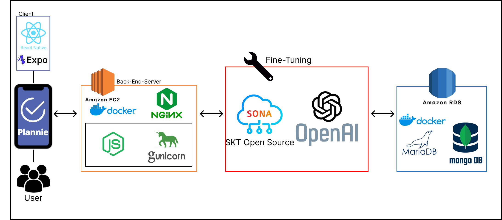

# 📆 AI로 학습된 챗봇으로 일정을 편리하게 관리할 수 있는 애플리케이션, Plannie

# 🖥️ Screens <<-- 여기에 프로젝트 설명도 같이

## 🗂️ Structure
[구조보기]()

## 서비스 요청 흐름도

## 🏋️‍♀️ 종사자

#### 🔧 GPT - FineTuner

🐭 [박승연](https://github.com/Syeonnny)

🍔 [박진서](https://github.com/orgs/kgu-mission/people/j2nseo)

#### ⛏️Back-FrontEnd
🐧 [장서진](https://github.com/juytj11) 

🐸 [유찬혁](https://github.com/ChanHyuckYou)

🐹 [문예진](https://github.com/orgs/kgu-mission/people/moonyaejin)

-----
# 📚 Stacks

## Environment

## FrontEnd
      

## BackEnd
      

## Infra
    

## Communication
  

##  ✉️향후 과제[2024.11.27 - ...]

1. 모델 성능 높이기...?
